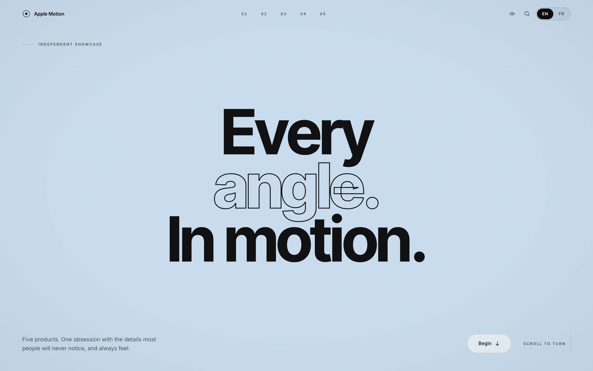
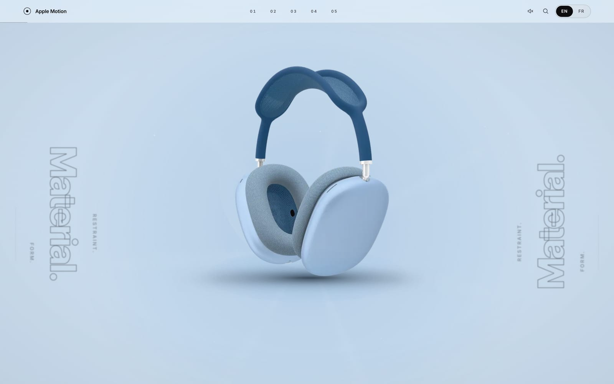
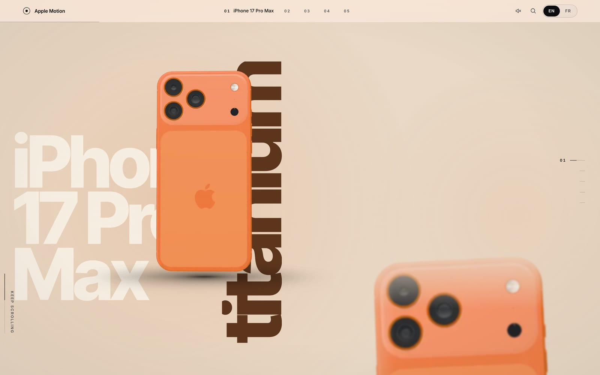
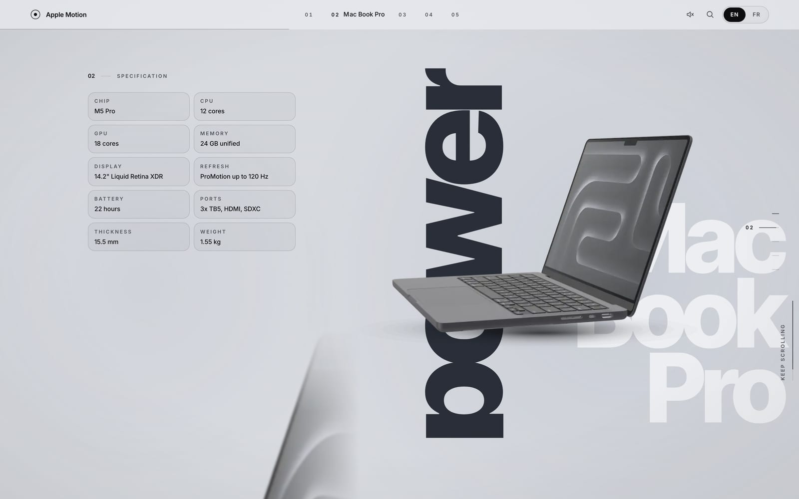
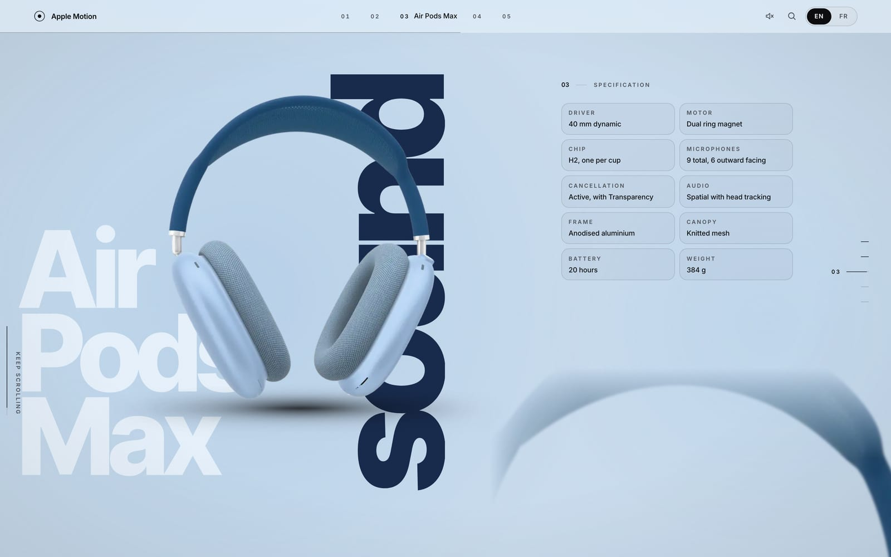
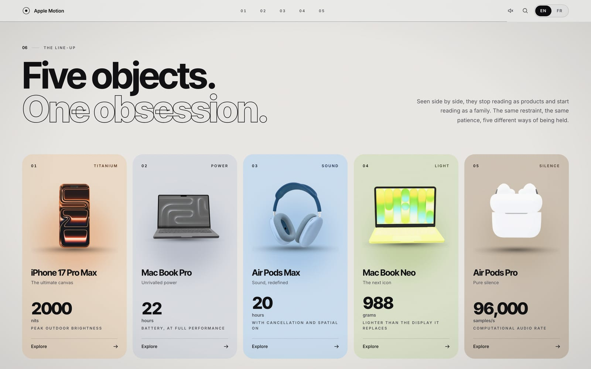
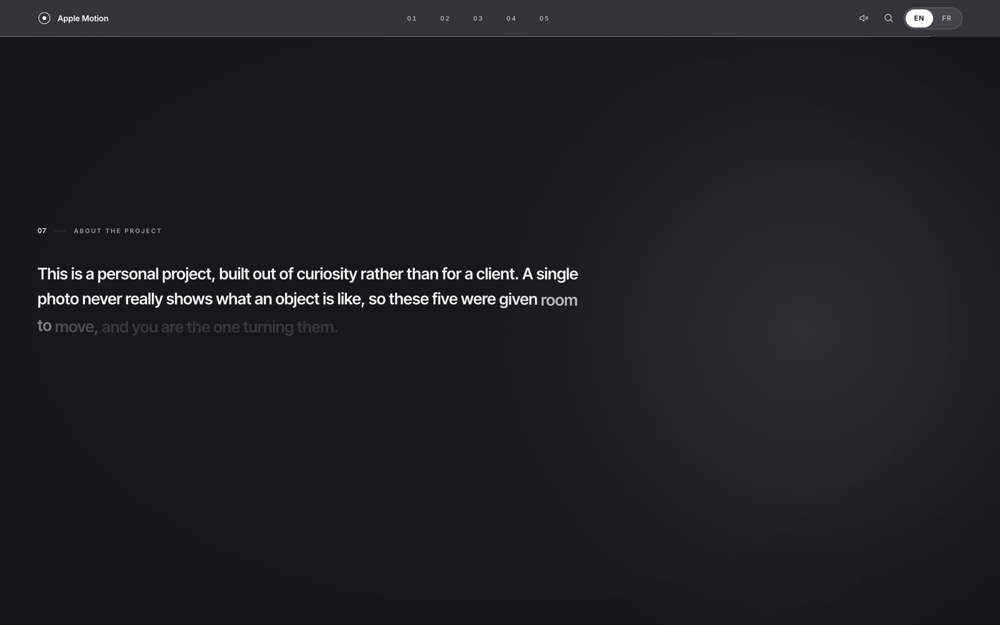
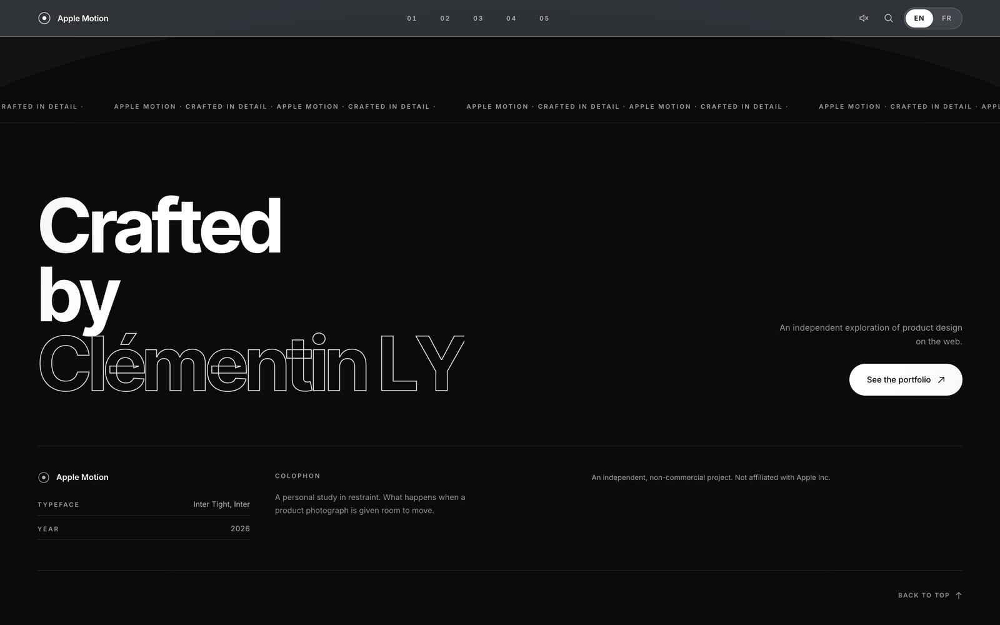

# Apple Motion

An independent showcase of Apple product design. Five products, each turning
under your scroll, rendered offline into an 180-frame sequence and played back
on a 2D canvas: no live 3D, no WebGL at runtime, just photographs that happen
to move exactly when you ask them to.

> **Not affiliated with Apple Inc.** This is a personal, non-commercial project
> built to explore product presentation on the web. Product names are used
> descriptively and remain the property of their respective owners. The site
> carries its own mark rather than Apple's.

---

## Screenshots

**The opening**



**The hero product, landed**



**A product section**



**Full specification, one product turning**



**Another product, another room**



**The line-up**



**The manifesto**



**The sign-off**



---

## Technology

| | |
| --- | --- |
| Framework | Next.js 16 (App Router, Turbopack), React 19, TypeScript |
| Styling | Tailwind CSS v4 |
| Motion | GSAP with ScrollTrigger, driven by a shared per-frame ticker |
| Smooth scroll | Lenis |
| Offline rendering | Three.js, React Three Fiber, drei (used only by the internal `/render` route, never shipped to the live site) |
| Image pipeline | sharp (crop, resize, WebP encode), glTF Transform + meshopt (model compression) |
| Testing | Playwright across Chromium, Chromium mobile and WebKit, `@axe-core/playwright` for accessibility |
| Fonts | Inter Tight (display) and Inter (body), self-hosted via `next/font` |
| Deployment | Vercel |

Nothing on the live page depends on a live 3D engine. The five products were
modelled and rendered once, offline, into flat image sequences. The
[render pipeline](#the-render-pipeline) below explains why.

## Features

- **Five products, one continuous tour.** Each section owns its own colour,
  its own layout side, and its own three-beat structure (overview, an
  annotated detail pass, then the full specification), tied to scroll
  position rather than to time.
- **English and French, switchable at runtime**, with every layout sized
  against the longer of the two strings so a language switch never clips a
  line or shifts the page.
- **A cinematic opening**: a loading sequence that fills in as the first
  product's frames actually arrive, then a title that shatters letter by
  letter as the product bursts through it.
- **A cursor that belongs to the room**: it swells over the product, takes a
  contextual label over the header and the spec tiles, and picks up the
  active room's own colour.
- **A command palette** (`/` to jump to a product, `?` for every shortcut),
  fully keyboard-navigable with a real focus trap.
- **A draggable progress rail** that doubles as a scrollbar on desktop.
- **Full WCAG AA coverage**, checked with automated `axe-core` runs at every
  scroll depth in CI, not just at the top of the page.
- **A real performance budget**, enforced in CI: sequence and model payload
  size are measured on every build and the build fails if either grows past
  its limit.
- **Branded 404 and error pages**, a generated sitemap and robots file, and
  Open Graph / Twitter card images built from the same visual system as the
  rest of the site.

## Running it

```bash
npm install
npm run dev            # http://localhost:3000
```

| Command | What it does |
| --- | --- |
| `npm run dev` | Development server |
| `npm run build` | Production build |
| `npm run typecheck` | TypeScript, no emit |
| `npm run lint` | ESLint (flat config) |
| `npm run test:e2e` | Playwright, against a production build |
| `npm run sequences` | Re-render every product sequence |

## The render pipeline

Three stages, all offline. None of it ships to the browser.

```
modeles-3D/*.glb            raw Sketchfab exports, 55.7 MB, gitignored
   |  node scripts/compress-models.mjs
   v
public/models/*.glb         meshopt + WebP textures, 15.8 MB, build-time only
   |  node scripts/render-sequences.mjs   (drives /render in a real browser)
   v
public/sequences/<id>/      180 transparent WebP frames + manifest.json
```

`/render` is a route that loads one product, exposes `window.__seek(frame)`,
and renders exactly one frame per call. The driver screenshots the canvas,
computes **one** crop box from the union of every frame's alpha extent, then
crops and encodes the whole sequence to that box. A shared box matters:
trimming each frame to its own content makes the product breathe in and out
as it rotates, because the silhouette's extent changes frame to frame.

Frames are transparent and tightly cropped, which is what keeps them small
and lets the background be plain CSS: a section can change colour instantly
with nothing to re-render.

### Why sequences, and not real-time 3D

The models are right there; rendering them live would have bought
interactivity for free. The case for real time rested entirely on one
feature, a finish picker that recoloured each product, and that is exactly
what makes sequences impossible: five products times four finishes times a
hundred and eighty frames is 3,600 images. Drop the picker, and one sequence
per product is 180 images, and every reason to prefer real time goes with it.

| | Real-time WebGL | Pre-rendered sequences |
| --- | --- | --- |
| Payload | 15.8 MB of geometry and textures | ~20 MB of WebP, fetched one product at a time |
| Runtime cost | Continuous GPU work, one context | `drawImage` per changed frame |
| Failure modes | Lost contexts, driver bugs, shader compile failures | A frame is either there or a neighbour is used |
| Quality ceiling | Whatever runs at 60 fps on the worst device | Whatever the renderer can do with unlimited time |
| Load behaviour | All-or-nothing per model | Coarse pass first, refined while you look at it |

The failure-modes row is the one that actually decided it. A real-time build
has failure modes a visitor can hit and a developer cannot reproduce. A
sequence has none.

**Why 180 frames and not 90.** Ninety frames over a full revolution is four
degrees a frame. On an object filling two thirds of the viewport that step
reads as judder when you scrub slowly: the scroll is smooth and the product
is not. Doubling the count halves the step, and there is nothing to
interpolate between two photographs of a rotating object, so more frames is
the only lever.

## Architecture

```
app/
  page.tsx            the showcase
  not-found.tsx        the 404 room
  error.tsx             the runtime error boundary
  render/               the offline frame renderer, never linked from the site
components/
  sequence/            the canvas player
  sections/             hero, product sections, line-up, manifesto, footer
  ui/                    loader, nav, cursor, progress rail, command palette
lib/
  sequence.ts          progressive loading, nearest-frame lookup, memory release
  catalogue.ts          the five products: name, anchor, room colours
  theme.ts               cross-fades the page's ground colour between products
  use-section-scroll.ts  ties one section's scroll range to its product sequence
  i18n/                   the bilingual dictionary and its context
```

### Scroll never touches React state

ScrollTrigger writes the scrub position into a ref; the canvas player reads
it inside its own animation loop and redraws only when the chosen frame
actually changes. At 120 Hz, routing that through `useState` would re-render
the tree a hundred times a second to draw one image. Every scroll-linked
animation on the page shares one `requestAnimationFrame` loop rather than
running its own.

### Memory is managed explicitly

A decoded 1000x1000 frame is 4 MB. A hundred and eighty of them is 720 MB,
and five products resident at once would exhaust a phone. Frames are held as
`ImageBitmap`, which can be released deterministically with `close()`, and
`retainOnly()` keeps at most the current section and its two neighbours
decoded.

### Loading is progressive, not all-or-nothing

Frames arrive in strides (every eighth, then every fourth, then the rest)
and the player draws the nearest frame it already has. Scrubbing is usable
after about twenty frames instead of a hundred and eighty, and the loading
screen releases at the first coarse pass.

## Design

- **The oversized product name is *lighter* than the wall it sits on.** A
  darker word reads as text you are meant to read; a lighter one reads as
  light falling on a surface.
- **Two ink tones, no more.** Both clear 4.5:1 on every ground the site uses.
  Labels are quieted with size and tracking rather than by washing out their
  colour, which is the usual way small type falls below the contrast floor.
- **Inter Tight for display, Inter for body.** The narrower apertures are
  what let a stacked product name hold together as one block at 200px.
- **Each product owns a room.** The ground colour cross-fades as a section
  takes over, so the whole page changes key at once instead of showing a
  seam.
- **One word per section is set as an outline.** It gives the page a second
  typographic voice without introducing a second typeface.
- **Sections are three beats, not one.** A product that rotates while a
  single paragraph sits beside it is turning for no reason. Each section
  runs its scroll range as three blocks that replace one another in place,
  and the windows deliberately do not overlap.

## Accessibility and internationalisation

- Full English and French, switchable at runtime, with `<html lang>` updated
  to match. A Playwright test fails if any text clips or the page scrolls
  sideways in either language.
- Every interactive control reachable and operable by keyboard, including in
  Safari, which excludes plain links from the default Tab order unlike
  every other engine, and is tested for separately because of it.
- The oversized display word is `aria-hidden`; the same words are the
  section's real heading.
- `prefers-reduced-motion` disables smooth scroll, the hero timeline and every
  reveal, and freezes the room colour instead of tweening it.
- Skip link, labelled controls, visible focus rings, a real modal focus trap
  in the command palette.
- Zero `axe-core` violations, checked at eight scroll depths across the page
  in CI, not only at the top.

## License

All rights reserved. See [LICENSE](LICENSE).

This is a personal portfolio piece, not an open-source project: the source
is visible, not licensed for reuse.
